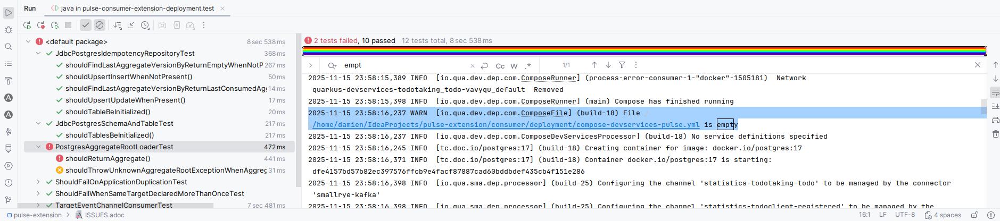

= ISSUES

== Build

Race condition on test - seeing in **consumer** module because sql files to create schema and aggregate_root table is are not executed.

Instead of using the generated **compose-devservices-pulse.yml** docker compose file it will start a **dev service redpanda** and a **dev service postgres**.

If it fails this message will be found in log:

[source]
----
2025-11-15 23:58:16,237 WARN  [io.qua.dev.dep.com.ComposeFile] (build-18) File /home/damien/IdeaProjects/pulse-extension/consumer/deployment/compose-devservices-pulse.yml is empty
----

This build issue may disappear when this issue will be resolved https://github.com/quarkusio/quarkus/issues/45785

https://github.com/quarkusio/quarkus/blob/main/extensions/devservices/deployment/src/main/java/io/quarkus/devservices/deployment/compose/ComposeFile.java#L38
