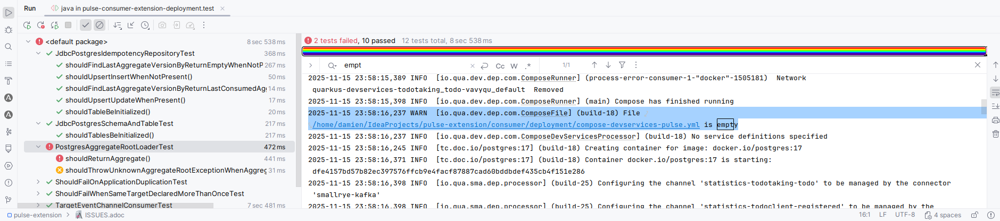

= ISSUES

== Build

Race condition on test - seeing in **consumer** module because sql files to create schema and aggregate_root table is are not executed.

Instead of using the generated **compose-devservices-pulse.yml** docker compose file it will start a **dev service redpanda** and a **dev service postgres**.

If it fails this message will be found in log:

[source]
----
2025-11-15 23:58:16,237 WARN  [io.qua.dev.dep.com.ComposeFile] (build-18) File /home/damien/IdeaProjects/pulse-extension/consumer/deployment/compose-devservices-pulse.yml is empty
----

This build issue may disappear when this issue will be resolved https://github.com/quarkusio/quarkus/issues/45785

https://github.com/quarkusio/quarkus/blob/main/extensions/devservices/deployment/src/main/java/io/quarkus/devservices/deployment/compose/ComposeFile.java#L38

=== zstd not supported on apache/kafka-native:4.2.0

switching to **lz4**

----
java.lang.NoSuchFieldError: com.github.luben.zstd.ZstdOutputStreamNoFinalizer.dstPos
        at org.graalvm.nativeimage.builder/com.oracle.svm.core.jni.functions.JNIFunctions$Support.getFieldID(JNIFunctions.java:1357)
        at org.graalvm.nativeimage.builder/com.oracle.svm.core.jni.functions.JNIFunctions.GetFieldID(JNIFunctions.java:449)
        at com.github.luben.zstd.ZstdOutputStreamNoFinalizer.resetCStream(Native Method)
        at com.github.luben.zstd.ZstdOutputStreamNoFinalizer.close(ZstdOutputStreamNoFinalizer.java:423)
        at com.github.luben.zstd.ZstdOutputStreamNoFinalizer.close(ZstdOutputStreamNoFinalizer.java:405)
        at java.base@21.0.2/java.io.FilterOutputStream.close(FilterOutputStream.java:193)
        at java.base@21.0.2/java.io.FilterOutputStream.close(FilterOutputStream.java:193)
        at org.apache.kafka.common.record.MemoryRecordsBuilder.closeForRecordAppends(MemoryRecordsBuilder.java:335)
        at org.apache.kafka.common.record.MemoryRecordsBuilder.close(MemoryRecordsBuilder.java:370)
        at org.apache.kafka.common.record.MemoryRecordsBuilder.build(MemoryRecordsBuilder.java:242)
        at org.apache.kafka.storage.internals.log.LogValidator.buildRecordsAndAssignOffsets(LogValidator.java:416)
        at org.apache.kafka.storage.internals.log.LogValidator.validateMessagesAndAssignOffsetsCompressed(LogValidator.java:368)
        at org.apache.kafka.storage.internals.log.LogValidator.validateMessagesAndAssignOffsets(LogValidator.java:135)
        at org.apache.kafka.storage.internals.log.UnifiedLog.lambda$append$1(UnifiedLog.java:1141)
        at org.apache.kafka.storage.internals.log.LocalLog.maybeHandleIOException(LocalLog.java:816)
        at org.apache.kafka.storage.internals.log.UnifiedLog.maybeHandleIOException(UnifiedLog.java:2468)
        at org.apache.kafka.storage.internals.log.UnifiedLog.append(UnifiedLog.java:1118)
        at org.apache.kafka.storage.internals.log.UnifiedLog.appendAsLeader(UnifiedLog.java:1036)
        at kafka.cluster.Partition.$anonfun$appendRecordsToLeader$1(Partition.scala:1239)
        at kafka.cluster.Partition.appendRecordsToLeader(Partition.scala:1227)
        at kafka.server.ReplicaManager.$anonfun$appendToLocalLog$8(ReplicaManager.scala:1430)
        at scala.collection.StrictOptimizedMapOps.map(StrictOptimizedMapOps.scala:28)
        at scala.collection.StrictOptimizedMapOps.map$(StrictOptimizedMapOps.scala:27)
        at scala.collection.mutable.HashMap.map(HashMap.scala:35)
        at kafka.server.ReplicaManager.appendToLocalLog(ReplicaManager.scala:1416)
        at kafka.server.ReplicaManager.appendRecordsToLeader(ReplicaManager.scala:646)
        at kafka.server.ReplicaManager.appendRecords(ReplicaManager.scala:703)
        at kafka.server.ReplicaManager.handleProduceAppend(ReplicaManager.scala:809)
        at kafka.server.KafkaApis.handleProduceRequest(KafkaApis.scala:544)
        at kafka.server.KafkaApis.handle(KafkaApis.scala:169)
        at kafka.server.KafkaRequestHandler.run(KafkaRequestHandler.scala:163)
        at java.base@21.0.2/java.lang.Thread.runWith(Thread.java:1596)
        at java.base@21.0.2/java.lang.Thread.run(Thread.java:1583)
        at org.graalvm.nativeimage.builder/com.oracle.svm.core.thread.PlatformThreads.threadStartRoutine(PlatformThreads.java:833)
        at org.graalvm.nativeimage.builder/com.oracle.svm.core.posix.thread.PosixPlatformThreads.pthreadStartRoutine(PosixPlatformThreads.java:211)
        Suppressed: java.lang.NoSuchFieldError: com.github.luben.zstd.ZstdOutputStreamNoFinalizer.dstPos
                at org.graalvm.nativeimage.builder/com.oracle.svm.core.jni.functions.JNIFunctions$Support.getFieldID(JNIFunctions.java:1357)
                at org.graalvm.nativeimage.builder/com.oracle.svm.core.jni.functions.JNIFunctions.GetFieldID(JNIFunctions.java:449)
                at com.github.luben.zstd.ZstdOutputStreamNoFinalizer.resetCStream(Native Method)
                at com.github.luben.zstd.ZstdOutputStreamNoFinalizer.write(ZstdOutputStreamNoFinalizer.java:343)
                at java.base@21.0.2/java.io.BufferedOutputStream.flushBuffer(BufferedOutputStream.java:125)
                at java.base@21.0.2/java.io.BufferedOutputStream.implFlush(BufferedOutputStream.java:252)
                at java.base@21.0.2/java.io.BufferedOutputStream.flush(BufferedOutputStream.java:240)
                at java.base@21.0.2/java.io.FilterOutputStream.close(FilterOutputStream.java:184)
                ... 29 more
        Suppressed: java.lang.NoSuchFieldError: com.github.luben.zstd.ZstdOutputStreamNoFinalizer.dstPos
                at org.graalvm.nativeimage.builder/com.oracle.svm.core.jni.functions.JNIFunctions$Support.getFieldID(JNIFunctions.java:1357)
                at org.graalvm.nativeimage.builder/com.oracle.svm.core.jni.functions.JNIFunctions.GetFieldID(JNIFunctions.java:449)
                at com.github.luben.zstd.ZstdOutputStreamNoFinalizer.resetCStream(Native Method)
                at com.github.luben.zstd.ZstdOutputStreamNoFinalizer.write(ZstdOutputStreamNoFinalizer.java:343)
                at java.base@21.0.2/java.io.BufferedOutputStream.flushBuffer(BufferedOutputStream.java:125)
                at java.base@21.0.2/java.io.BufferedOutputStream.implFlush(BufferedOutputStream.java:252)
                at java.base@21.0.2/java.io.BufferedOutputStream.flush(BufferedOutputStream.java:240)
                at java.base@21.0.2/java.io.DataOutputStream.flush(DataOutputStream.java:131)
                at java.base@21.0.2/java.io.FilterOutputStream.close(FilterOutputStream.java:184)
                ... 28 more
----

== mixed Build-time and Runtime config on the same config root

When mixing Build-time and Runtime config on the same config root, this exception can occur – not more the case here because the code has been reverted.

----
[ERROR] Failed to execute goal io.quarkus:quarkus-maven-plugin:3.33.1.1:build (default) on project quarkus-pulse-extension-integration-tests-infrastructure: Failed to build quarkus application: Configuration validation failed:
[ERROR]         java.util.NoSuchElementException: SRCFG00014: The config property XXXXXXXXXXXXX is required but it could not be found in any config source
[ERROR]         SRCFG00050: pulse.datasource.init-at-startup in PropertiesConfigSource[source=jar:file:///home/damien/IdeaProjects/pulse-extension/integration-tests/infrastructure/target/quarkus-pulse-extension-integration-tests-infrastructure-1.0.0-SNAPSHOT.jar!/application.properties]:15 does not map to any root
----

Have a look at these online resources:

https://github.com/quarkusio/quarkus/discussions/47981

https://smallrye.io/smallrye-config/Latest/config/customizer/

Here is a reproducer to explain the issue https://github.com/dcdh/greeting-config-extension

It is ok when

In pulse this **CommonConfigBuilder** has been created and referenced in **resources/META-INF/services/io.smallrye.config.SmallRyeConfigBuilderCustomizer** of **quarkus-pulse-common-extension**
